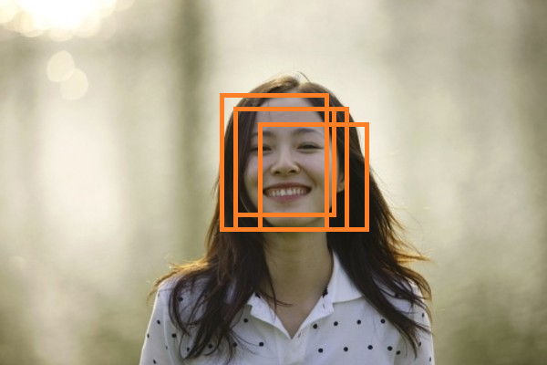
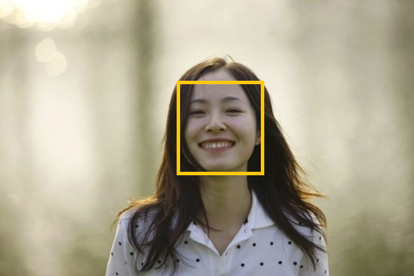
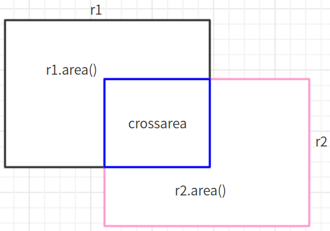

>>在目标检测中，常会利用非极大值抑制算法(Non-maximum suppression,NMS)对生成的大量候选框进行后处理，去除冗余的候选框，得到最具代表性的结果，以加快目标检测的效率。即如下图所示，消除多余的候选框，找到最佳的bbox。 

!

## NMS算法过程
根据候选框的类别分类概率做排序：A<B<C<D<E<F

### step1
先标记最大概率矩形框F是我们要保留下来的；
### step2
从最大概率矩形框F开始，分别判断A~E与F的重叠度IOU（两框的交并比）是否大于某个设定的阈值，假设B、D与F的重叠度超过阈值，那么就扔掉B、D；
### step3 
从剩下的矩形框A、C、E中，选择概率最大的E，标记为要保留下来的，然后判读E与A、C的重叠度，扔掉重叠度超过设定阈值的矩形框
就这样一直重复下去，直到剩下的矩形框没有了，标记完所有要保留下来的矩形框

## 自己的理解
- 对所有候选的矩形根据其得分(score)从大到小排序
- 选择得分最高的一个矩形，计算她与剩余的矩形的交叉面积占比(相似度),如果相似度小于阈值则标记保留
  否则标记为删除。
- 按照score排序，继续从剩余的没有被标记删除的矩形中选择一个，与排在它后面的没有被标记删除的矩形计算相似度；依次标记
- 直到循环结束
- 将被标记为保留的矩形输出

$$iou =  \frac{corssarea}{r1.area() + r2.area() - crossarea} $$