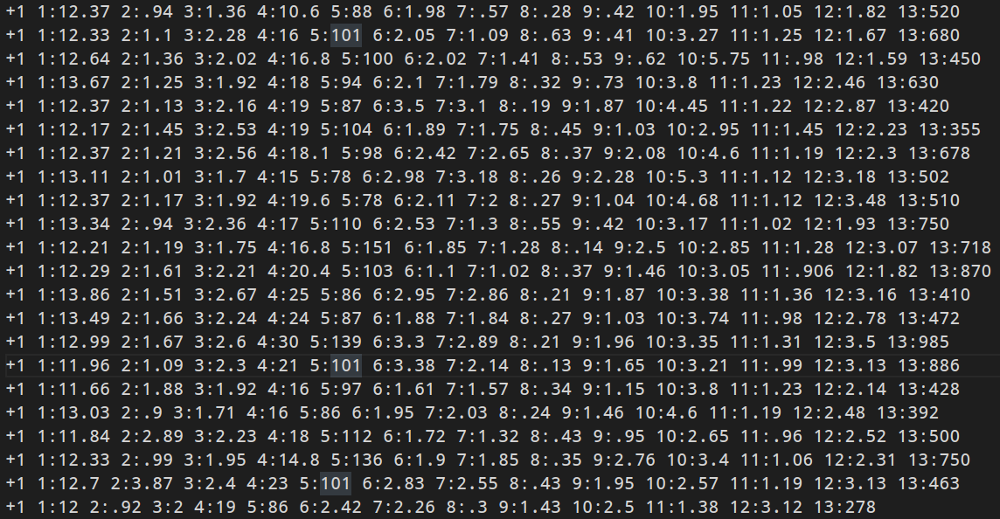

## 一些说明
训练输入数据格式



## svm-scale
- 缩放规则
$$
y^* = lower+(upper - lower)*\frac{y-min}{max - min}
$$
- 使用方法
```shell
Usage: svm-scale [options] data_filename

options:

-l lower : x scaling lower limit (default -1)

-u upper : x scaling upper limit (default +1)

-y y_lower y_upper : y scaling limits (default: no y scaling)

-s save_filename : save scaling parameters to save_filename

-r restore_filename : restore scaling parameters from restore_filename 
```
我们使用命令 "> train1.scaled" 将结果输出在文件 train1.scaled中：
```shell
svm-scale > scale.scaled
```
我们使用命令 "-s train.range" 将缩放规则保存在文件train.range 中：
```shell
svm-scale -s train.range tarin1 > train1.scaled
```
归一化至0-1
```shell
./svm-scale -l 0 -u 1 -s libsvmwine.range libs
```

## svm-train
- 使用

```shell
svm-train 训练数据文件
```
输出 inpudatafile.model 

## svm-predict
```shell
svm-predict 测试数据文件 训练好的模型文件(.model) 预测结果输出文件(.out)
```
